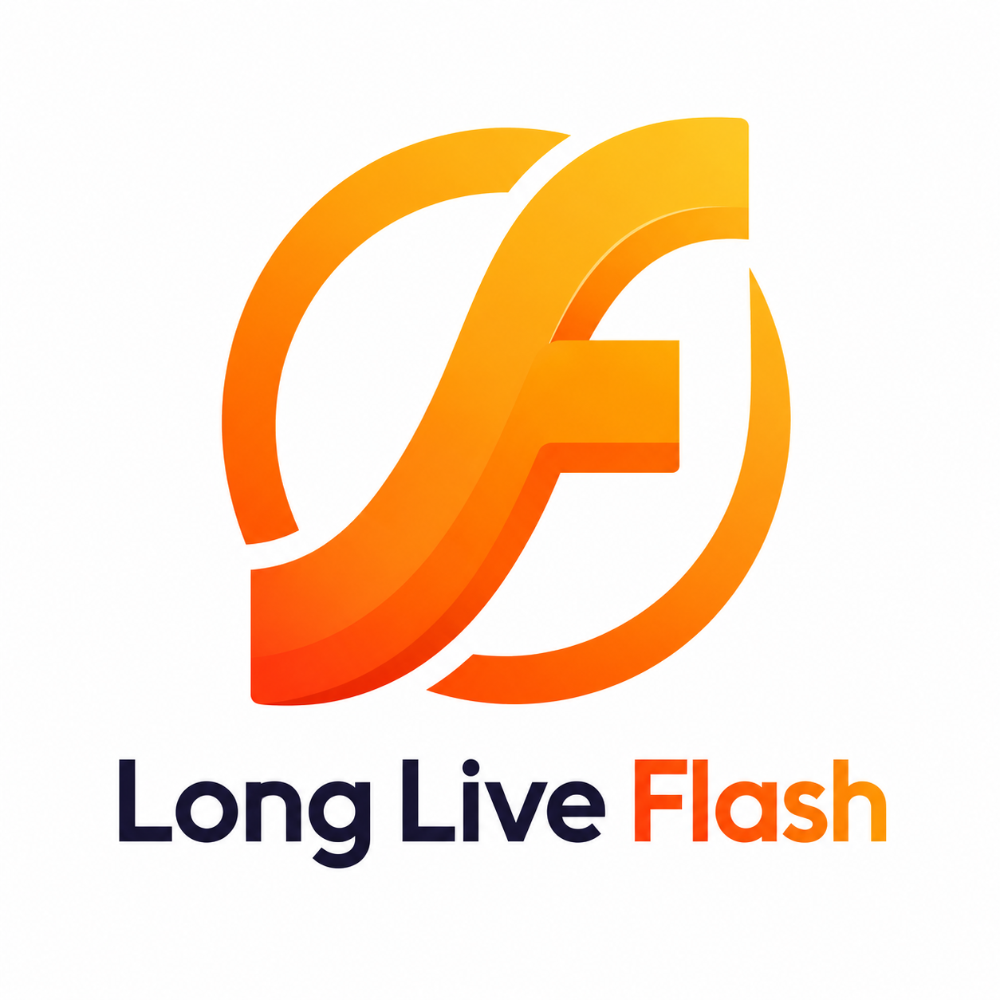

<p align="center">
  <a href="https://beyonderluu.com/"></a>
</p>

# Llflash

Llflash is an Adobe Flash Player emulator written in the Rust programming language. Llflash targets both the desktop and the web using WebAssembly.

## Table of Contents

* [Project status](#project-status)
* [Using Llflash](#using-llflash)
* [Building from source](#building-from-source)
  * [Prerequisites](#prerequisites)
  * [Linux prerequisites](#linux-prerequisites)
  * [Desktop](#desktop)
  * [Web or Extension](#web-or-extension)
  * [RTMP native messaging host](#rtmp-native-messaging-host)
  * [Build everything](#build-everything)
  * [Android](#android)
  * [Scanner](#scanner)
  * [Exporter](#exporter)
* [Structure](#structure)
* [Sponsors](#sponsors)
* [License](#license)
* [Contributing](#contributing)

## Project status

Llflash supports ActionScript 1, 2 and 3 pretty well, but it's still not finished by any means. Please report any issues in the Issue Tracker.

## Using Llflash

The easiest way to try out Llflash is to visit the [web demo page](https://beyonderluu.com/demo/), then click the "Select File" button to load a SWF file of your choice.

[Nightly builds](https://beyonderluu.com/downloads#nightly-releases) of Llflash are available for desktop and web platforms.

For more detailed instructions, see our wiki page.

## Building from source

This repo ships a `Makefile` that wraps all source builds. Primary target is macOS; Linux works
with the same recipes (a recent `zsh` is required, since the Makefile uses `SHELL := /bin/zsh`).
Run every command below from the repo root.

### Prerequisites

Check what's installed, then auto-install whatever is missing:

```shell
make check-deps     # report status of cargo, node, pnpm, java, wasm32 target, wasm-bindgen
make install-deps   # idempotent — installs rustup, wasm32 target, wasm-bindgen-cli, enables pnpm
```

The tools `make install-deps` cannot install for you:

* Java (JDK 17+) — required for building the ActionScript 3 builtins library
* Node.js (>= 24) — required for the web extension build

### Linux prerequisites

Linux users need the following system packages before `make install-deps`:

* Ubuntu/Debian:

  ```shell
  sudo apt install pkg-config libasound2-dev libudev-dev default-jre-headless g++
  ```

* Fedora/RHEL:

  ```shell
  sudo dnf install pkgconf-pkg-config alsa-lib-devel systemd-devel java-latest-openjdk-headless gcc-c++
  ```

### Desktop

Build the desktop app (release):

```shell
make build-desktop
```

Run the desktop app in debug mode:

```shell
make run-desktop
```

### Web or Extension

Build the web extension and the selfhosted bundle:

```shell
make build-extension
```

See [`web/README.md`](web/README.md) for details on individual web packages.

This project is tested with BrowserStack.

### RTMP native messaging host

Build the MV3 native messaging host used by the browser extension for RTMP streaming, then
install its manifest:

```shell
make build-rtmp-host
make install-rtmp-host BROWSER=chrome   # macOS/Linux; BROWSER defaults to chrome
```

On Windows, run the PowerShell installer instead:

```powershell
PowerShell -ExecutionPolicy Bypass -File native-host/install.ps1
```

### Build everything

```shell
make build   # build-desktop + build-extension
make clean   # remove all build artifacts
```

### Android

Follow the instructions in the `llflash-android` project for building the Android application of Llflash.

### Scanner

If you have a collection of "real world" SWFs to test against, the scanner may be used to benchmark
Llflash's parsing capabilities. Provided with a folder and an output filename, it will attempt to read
all of the Flash files and report on the success of such a task. The scanner has no Makefile target —
invoke it directly with cargo:

`cargo run --release --package=llflash_scanner -- scan folder/with/swfs/ results.csv`

### Exporter

If you have a SWF file and would like to capture an image of it, you may use the exporter tool.
This currently requires hardware acceleration, but can be run headless (with no window). The
exporter has no Makefile target — invoke it directly with cargo:

* `cargo run --release --package=exporter -- path/to/file.swf`
* `cargo run --release --package=exporter -- path/to/file.swf path/to/screenshots --frames 5`

## Structure

* `core` - core emulator and common code
* `swf` - SWF and ActionScript parser
* `desktop` - desktop client (uses `wgpu-rs`)
* `web` - web client and browser extension (uses `wasm-bindgen`)
* `render` - various rendering backends for both desktop and web
* `video` - video decoding backends
* `flv` - Flash Video decoder
* `wstr` - a Flash-compatible implementation of strings
* `scanner` - a utility to bulk parse SWF files
* `exporter` - a utility to generate PNG screenshots of a SWF file
