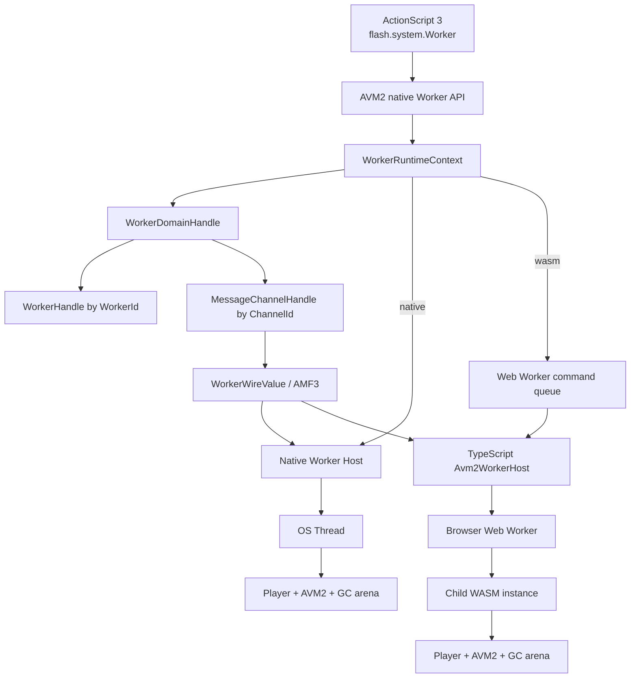
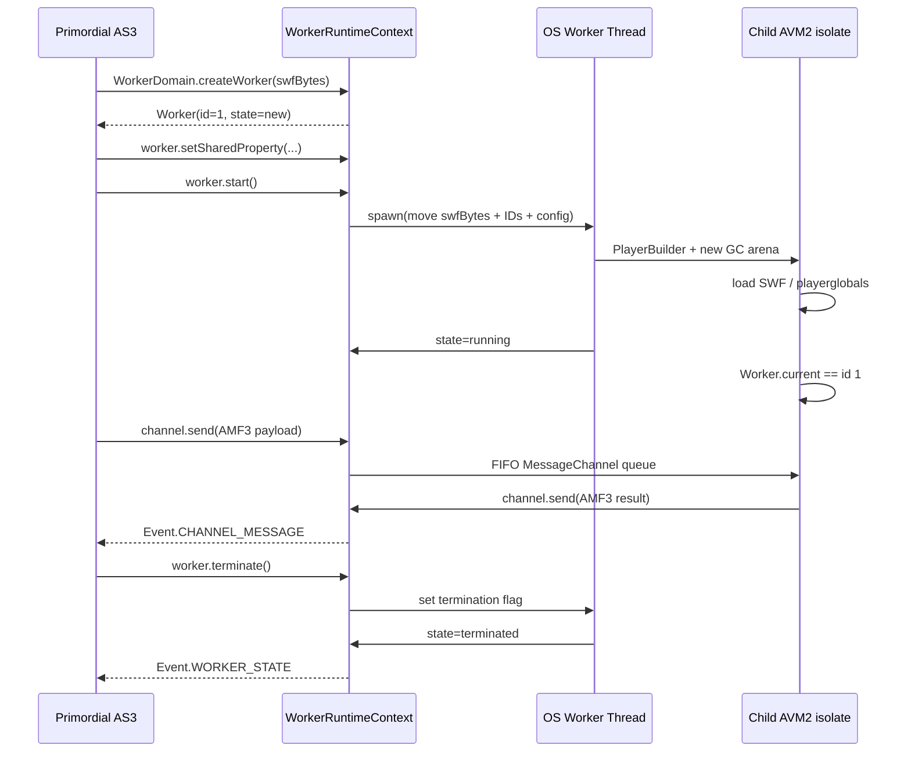
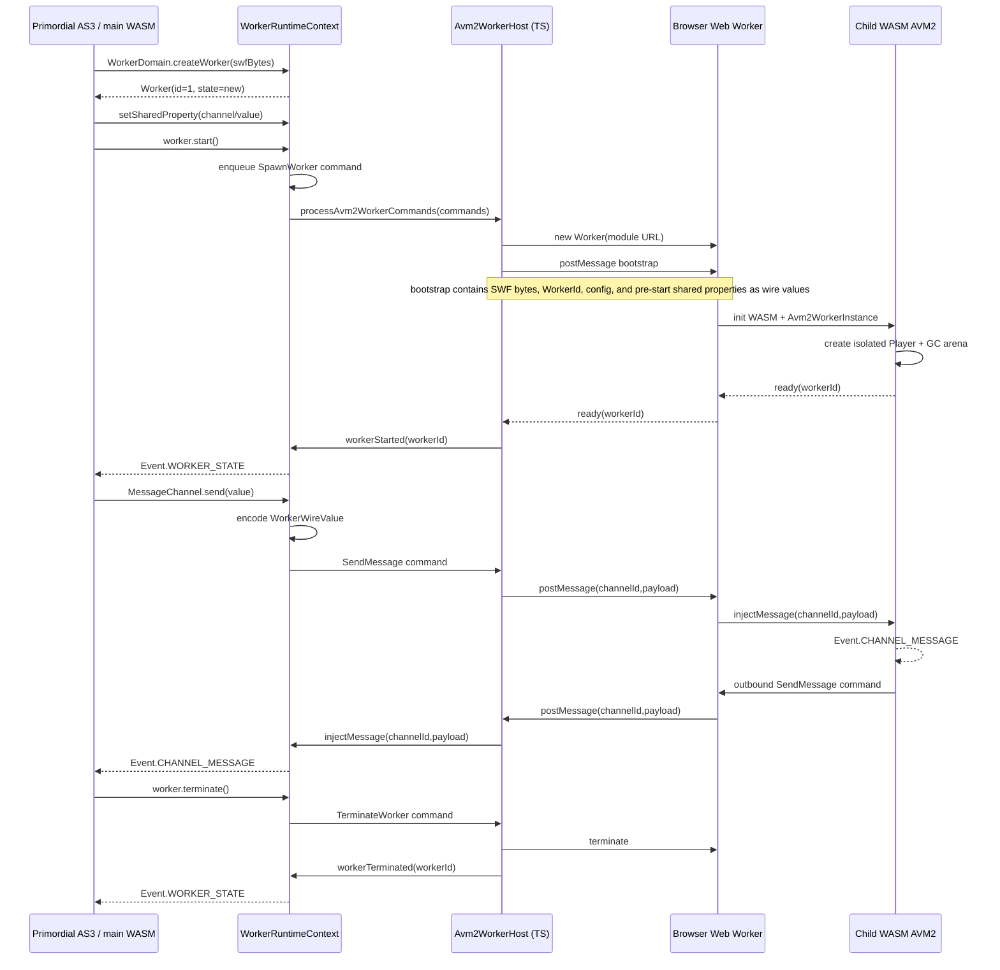
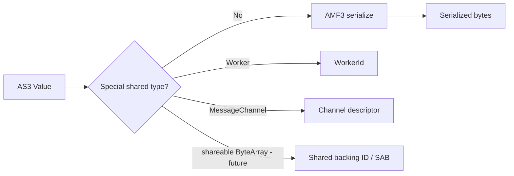

# AVM2 Worker Architecture

## Scope

Llflash must implement `flash.system.Worker` as a real isolate model rather than running worker bytecode cooperatively inside the primordial AVM2 instance.

The design has one semantic model and two execution backends:

- Native desktop: one AVM2 isolate per OS thread.
- Web/WASM: one AVM2 isolate per browser `Web Worker`, each loading its own WASM instance.

The primordial AVM2 isolate never shares GC-managed values directly with a background isolate. Cross-isolate data is represented by stable IDs and wire values.

## Goals

1. Preserve Flash Worker isolation semantics.
2. Never send `Value<'gc>`, `Object<'gc>`, `Gc`, `Rc<RefCell<GcArena>>`, or display-list objects across isolates.
3. Use real parallel execution on native and browser targets.
4. Keep one AS3 API surface for both backends.
5. Keep `Worker.isSupported` truthful. A platform is only reported as supported when its Worker host is enabled.
6. Allow Worker support to be disabled explicitly.
7. Make MessageChannel FIFO and event driven.
8. Build toward shareable `ByteArray`, `Mutex`, and `Condition` without redesigning Worker identity later.

## Non-goals

- Automatically parallelizing arbitrary AVM2 bytecode that does not create `flash.system.Worker` instances.
- Sharing display-list state across workers.
- Sharing GC pointers across AVM2 arenas.
- Treating the existing hidden-tab background tick Web Worker as an AS3 Worker.

## Component architecture



## Isolation model

Each background Worker owns:

- its own `Player`;
- its own `GcArena`;
- its own `Avm2` state;
- its own playerglobals statics;
- its own timers and action queue;
- a stable `WorkerId` shared only as plain integer identity.

This means `Worker.current` is isolate-local and resolves to the handle corresponding to the current isolate.

Objects that cross the Worker boundary are either copied or represented by stable handles:

| AS3 value | Transport |
| --- | --- |
| primitive/string/plain serializable object | AMF3 copy |
| `Worker` | `WorkerId` |
| `MessageChannel` | `MessageChannelId + sender + receiver` |
| shareable `ByteArray` | future shared backing ID / SharedArrayBuffer |
| `Mutex` | future shared synchronization ID |
| `Condition` | future shared synchronization ID |

## Native execution



## Web/WASM execution

A browser Worker cannot receive Rust GC pointers from the main WASM instance. The child therefore loads a second WASM instance and reconstructs Worker/MessageChannel handles from IDs.



## Web command protocol

Main WASM -> TypeScript host:

```text
SpawnWorker {
  workerId,
  swfBytes,
  playerVersion,
  playerRuntime,
  playerMode,
  sharedProperties[]
}

SendMessage {
  channelId,
  senderWorkerId,
  receiverWorkerId,
  value
}

CloseChannel { channelId }
TerminateWorker { workerId }
```

Browser Worker -> parent:

```text
Ready { workerId }
SendMessage { channelId, value }
ChannelClosed { channelId }
Terminated { workerId }
Error { workerId, message }
```

`value` is a wire value and never an AVM2 GC value.

## Worker wire values



The receiver reconstructs a new AS3 wrapper inside its own GC arena.

## MessageChannel rules

- One sender Worker and one receiver Worker.
- FIFO ordering per channel.
- Sender never accesses the receiver's GC arena.
- On native, both isolates reference the same thread-safe channel handle.
- On web, the sender emits a host command and the receiving WASM instance injects the payload into its local channel handle with the same `MessageChannelId`.
- `Event.CHANNEL_MESSAGE` is emitted only in the receiver isolate.
- Closing transitions `open -> closing -> closed` and queued messages are drained before final close.

## Shared properties

Native uses a synchronized store on `WorkerHandle`.

For web, pre-start shared properties are copied into the Worker bootstrap. This covers the standard Flash bootstrap pattern where MessageChannels are placed on the Worker before `start()`.

Dynamic post-start shared properties require a synchronous cross-worker shared store. That will be implemented together with `SharedArrayBuffer`-backed shared memory. Until that layer exists, web compatibility guarantees pre-start bootstrap properties and MessageChannel transport, not arbitrary synchronous post-start mutations.

## Shareable ByteArray roadmap

Native:

```text
ByteArrayStorage
  Local(Vec<u8>)
  Shared(Arc<SharedByteArrayBacking>)
```

Web:

```text
ByteArrayStorage
  Local(Vec<u8>)
  Shared(SharedArrayBuffer + byte offset + length metadata)
```

`position`, `endian`, and `objectEncoding` remain wrapper-local where Flash semantics require local cursor state. Backing bytes are shared.

## Mutex and Condition roadmap

- Native: `Arc<MutexState>` / `Condvar` handles referenced by stable IDs.
- Web: `SharedArrayBuffer` + `Atomics.wait/notify` inside browser Worker contexts.
- Main browser thread must never block with `Atomics.wait`.

## Configuration

Native desktop:

```text
Worker enabled by default
--no-worker => Worker.isSupported == false
```

Core:

```rust
PlayerBuilder::new().with_worker_enabled(true)
PlayerBuilder::new().with_worker_enabled(false)
```

Web:

Worker support is enabled when the browser Worker host is installed. The web frontend owns spawning/termination of browser workers. If the host cannot initialize, Worker support must report unavailable rather than silently falling back to cooperative execution.

## Error and shutdown rules

1. Worker parse/verification errors terminate only that Worker isolate.
2. A child Worker panic/error must not corrupt the primordial Player.
3. Native shutdown is cooperative; no unsafe thread killing.
4. Browser shutdown uses `Worker.terminate()` after marking the Worker terminated in the main runtime.
5. Player destruction terminates all child workers.
6. No code should wait for a Worker while holding the primordial `Player` mutex.

## Testing matrix

### Core/native

- `Worker.isSupported` on/off.
- `Worker.current.isPrimordial`.
- state transitions.
- real child AVM2 execution.
- main -> child MessageChannel.
- child -> main MessageChannel.
- FIFO ordering.
- AMF3 object copy isolation.
- queue limit behavior.
- close/drain behavior.
- termination during a busy loop.

### Web

- browser Worker is physically created.
- child loads a separate WASM instance.
- child `Worker.current` resolves to the child ID.
- pre-start shared MessageChannels reconstruct by ID.
- main -> child -> main round trip returns expected data.
- `Event.CHANNEL_MESSAGE` fires in the correct isolate.
- terminate removes browser Worker and state becomes `terminated`.
- unavailable Worker host reports `Worker.isSupported == false`.

## Implementation phases

- [x] Native Worker identity/lifecycle.
- [x] Native separate AVM2/GC isolate on OS thread.
- [x] MessageChannel core queue and events.
- [x] AMF3 cross-worker copy values.
- [x] Worker/MessageChannel stable handles.
- [x] Worker enable/disable option on native.
- [x] Native integration test using a real SWF.
- [ ] Web command protocol in core.
- [ ] Browser `Avm2WorkerHost`.
- [ ] Child WASM `Avm2WorkerInstance`.
- [ ] Web MessageChannel round-trip integration test.
- [ ] Dynamic web shared-property store.
- [ ] Shareable ByteArray.
- [ ] Mutex/Condition.
